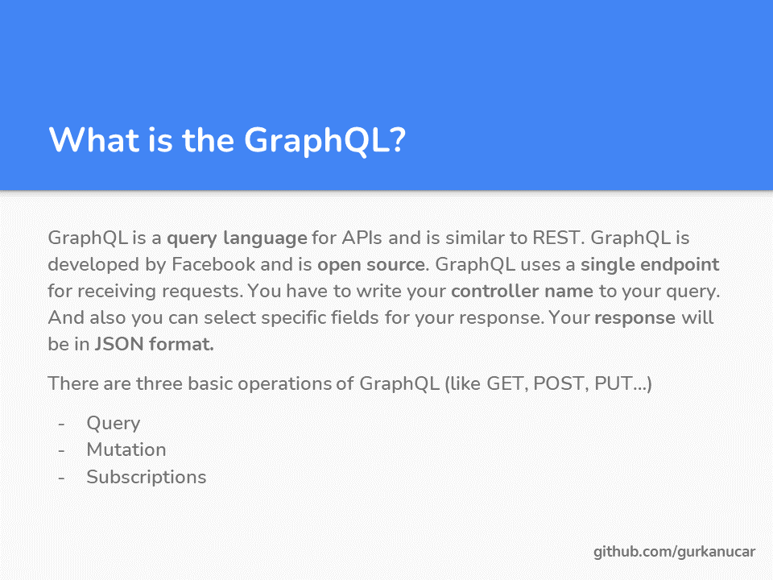
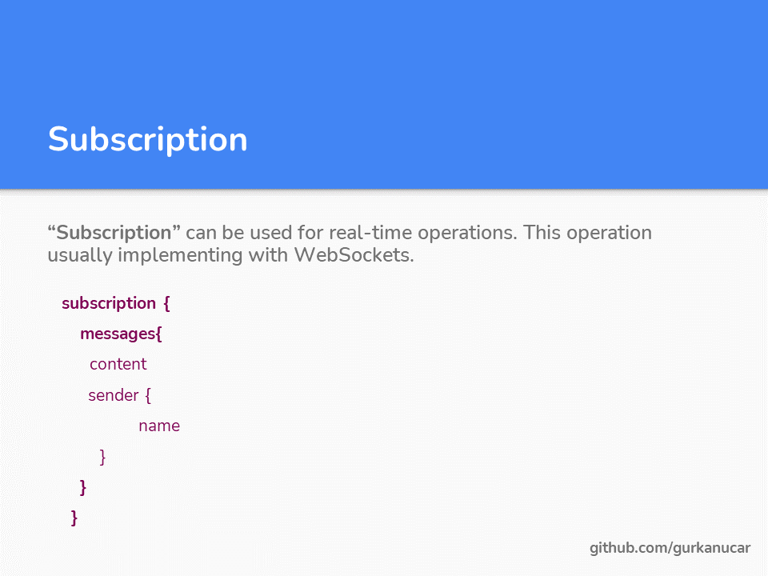
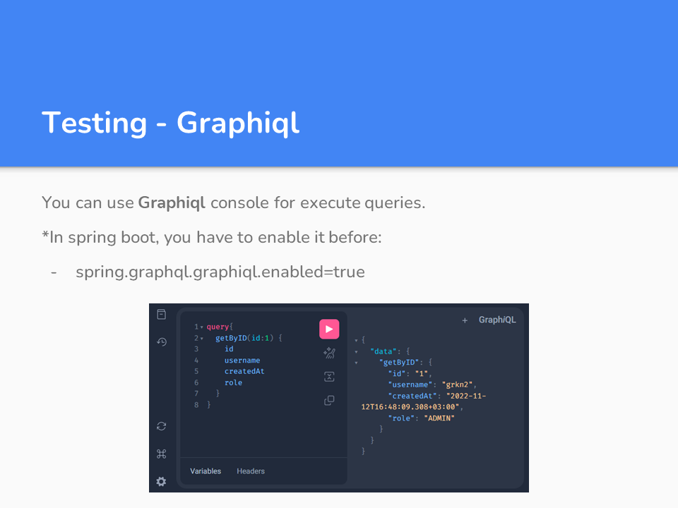
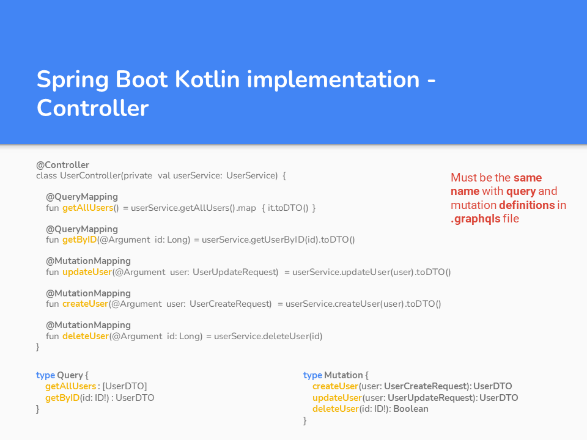

# Spring Boot - Kotlin - GraphQL


### How to run

#### clone the project: https://github.com/gurkanucar/spring-boot-kotlin-graphql

```bash
  git clone https://github.com/gurkanucar/spring-boot-kotlin-graphql
  cd spring-boot-kotlin-graphql
```
#### run tests


```bash
  mvn test
```

#### run app

```bash
  mvn spring-boot:run
```














